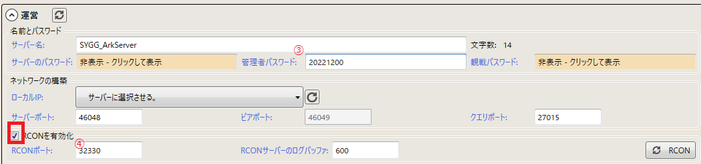
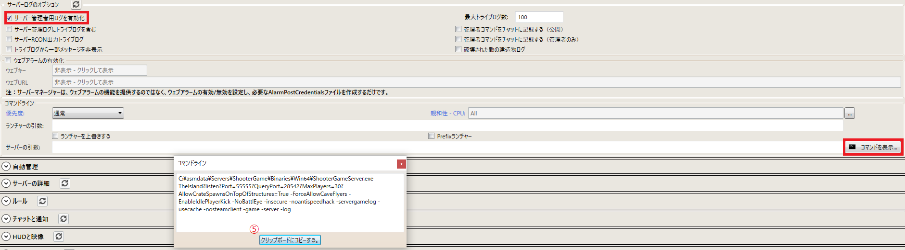
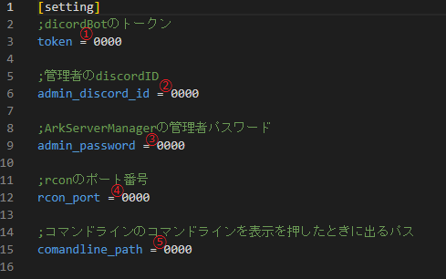

# ASM_discord_manage
[ArkServerManager](https://arkservermanager.freeforums.net/thread/5193/downloads)をdiscordで管理できます
[Download](https://github.com/pukusyou/ASM_discord_manage/releases/tag/0.0.1)
# Setting
* (ArkServerManager の設定は完了しているものとします)
* config.iniを開きます
* 下記のように設定を書き換え, 保存します
* ASM_discord_manage.exeを実行します

1. [dicord Developer Portal](https://discord.com/developers/applications)でBotを作成しトークンを①に書き換える
2. ②を自分のdiscordIDに書き換える
3. ③④⑤のそれぞれ画像に対応するところを書き換える
4. rconを有効化, サーバー管理者用ログを有効化にチェックを入れる
5. 保存

# How to use
* /start_server: サーバーを起動します
* /stop_server: サーバーを停止します
* /message_all: (アルファベットのみ)サーバーに入っている人全員にメッセージを送信します
* /num_of_players: 現在のオンラインのプレイヤー数を表示します
* /get_players_name: 現在のオンラインのプレイヤー名を表示します
* /is_server_change: (バグ発生時)サーバーの実行状態を手動で切り替えます
* /pc_resource: pcの負荷を確認できます
# Operating environment
* windows10
* python 3.10.8
* discord.py 2.1.0
* psutil 5.9.4
* mcrcon 0.7.0
* ArkServerManager 日本語環境

# Test environment
* Windows10
* ArkServerManager 1.1.438.1

# Note
Currently, some functions do not work well in non-Japanese environments. If necessary, this may be addressed in an update.

# In the end
Thank you for creating ArkServerManager!
